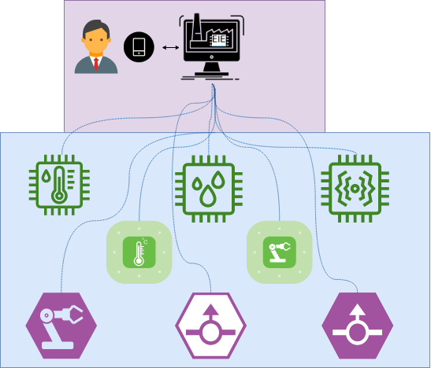
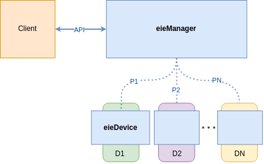

******************************
Laboratorio: 1
******************************

Planeamiento
++++++++++++++
En una reunión con los gerentes e ingenieros de la fábrica la cual contrató a la star-up eie-labs, se acordó que el prototipo de software para el administrador de IoT, aplicado a dispositivos interconectados en la red de la fábrica requiere dos componentes principales: ``eie_manager`` y ``eie-device``, el bosquejo inicial del sistema es el siguiente:

   
Después de un tiempo planeando como hacer los releases utilizando la metodología `agile <https://www.atlassian.com/agile/agile-at-scale/long-term-agile-planning>`_, dándole prioridad a los objetivos de negocio se estableció como prioridad implementar un API expuesto por ``eie_manager`` que permita la comunicación con el  ``Client``, con una versión de prueba del ``eie_manager`` de modo que pueda devolver alguna respuesta básica sin importar el lenguaje de programación con el que se desarrolle la aplicación del lado del ``Client``. Con esta API implementada, el equipo del desarrollo de la aplicación móvil puede comenzar a trabajar lo antes posible para no atrasar el producto final. Otra característica a la que se le debe dar prioridad es la creación de una clase abstracta ``device`` que sea fácilmente modificable en cada instancia creada, con esto se puede asegurar el soporte varios de dispositivos heterogéneos. Luego es importante desarrollar un sistema para la administración de los comandos que se puede enviar a los diferentes devices, de modo que se puedan agregar nuevos comandos según las necesidades del cliente, se pensó en dividir este sistema en un ``Command_Registry`` que guarde el registro de comandos aceptables por los devices, un ``Command`` para implementar la funcionalidad de cada comando y un ``Command_Manager`` para la ejecución y registro de nuevos comandos.

Posibles epics para este diseño pueden ser los siguientes:

* Implementar un protocolo, ``API_Server`` dentro del módulo  ``eie_manager`` para establecer la comunicación con el  ``Client``

* Crear una clase ``device`` y un objeto de esta clase que interactue con ``eie_manager`` mediante un protocolo basado en `remote procedure calling (RPC) <https://www.geeksforgeeks.org/remote-procedure-call-rpc-in-operating-system/>`_, para demostrar el funcionamiento del prototipo

* Implementar una logica de administración de comandos, utilizando un archivo ``Command_Registry`` que guarde los archivos en formato ``jSON``, una clase ``Command`` que implemente las funciones que van a realizar los dispositivos al recibir un comando específico y un ``Command_Manager`` que implementa la clase  ``Command`` para ejecutar commando y registrar comandos nuevos.

* Implementar un ``Transport_Server`` para responder las solicitudes de comandos provenientes del cliente

* Implementar un cliente básico para simular los request provenientes del cliente y asegurar que el flujo de datos se da correctamente.

Requerimientos
++++++++++++++

- ``eie-device``
   - El ``eie-device`` debe ser creado como una clase abstracta que permita la modificación y la creación de nuevos dispositivos heterogeneos.
   - El ``eie-device`` debe soportar la recepción de comandos y enviar una respuesta a través de un ``API_Server`` que permita la comunicación ``eie_manager``.

- ``eie_manager``
   - El ``eie_manager`` debe proveer una estructura de administración de comandos,  utilizando comandos configurados en la clase ``command`` y provenientes de ``command_manager``, los cuales son enviados a través del modulo de transporte de datos ``transport_server``.
   - La clase ``command`` debe poder crear, leer, borrar y modificar comandos en el registro de comandos soportado por los dispositivos ``command_registry``.
   - El ``transport_server`` debe recibir comandos provenientes del cliente mediante un  ``API_Server`` en forma de ``JSON`` serializado y 	debe poder separar información de acuerdo al tipo de request recibido.
   - El ``command_manager`` debe registrar y ejecutar comandos soportados por los dispositivos utilizando la clase ``command``

Atribute-Driven Design (ADD)
++++++++++++++++++++++++++++

Patrones de diseño
++++++++++++++++++++++++++++

Al realizar los diseños y diagramas de clase se propuso utilizar el patrón de diseño `Proxy <https://refactoring.guru/es/design-patterns/proxy>`_ para abstraer la comunicación entre devices y cliente, de modo que el eie_manager funcione como una interfaz entre ambas partes para que no se comuniquen directamente los devices y los clientes.

Se propuso utilizar un sistema de manejo de comandos para separar responsabilidades en el ``eie_manager``, mediante el patron de diseño `Command <https://refactoring.guru/es/design-patterns/command>`_ para convertir las solicitudes a cada ``device`` en objetos independientes que contengan toda la información del comando a ejecutar, logrando desacoplar el envio de datos del resto de componentes del ``eie_manager``. Aplicando este patron de diseño a nuestra plataforma de IoT, se facilita el encapsulamiento de información agregando identificadores a los comandos, se puede serializar la información para ser recibida en otros componentes y esperar la respuesta de acuerdo a dicho identificador.

Diagramas
+++++++++
1. El ``client`` envía un comando a un dispositivo específico.

.. uml::

  @startuml
  participant Client
  participant "transport_server"
  participant "command_manager"
  participant  "device"
  Client->transport_server: Send command request through API
  transport_server->transport_server: parse JSON data
  transport_server-> "command_manager": Send command data
  "command_manager"-> "command_manager": call command class 
  "command_manager"-> "device": Send command data through API
  "device"-> "device": Execute user command and send response back
  @enduml

2. El ``Client`` envía un comando a un grupo de broadcast..

.. uml::

  @startuml
  participant Client
  participant "transport_server"
  participant "command_manager"
  participant "Group_handler"
  participant  "devices"
  Client->transport_server: Send command request through API
  transport_server->transport_server: parse JSON data
  transport_server-> "command_manager": Send command data
  "command_manager"-> "command_manager": call command class 
  command_manager-> "Group_handler": Identify broadcast devices
  "Group_handler"-> "devices": Send command data through API
  "devices"-> "devices": Execute user command and send response back
  @enduml

